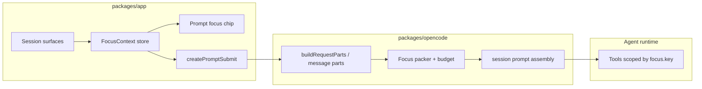

# Agent Focus Context — ambient “what you see” for Studio agents

> **Status:** Spec v1 — ready to seed work units on the **studio** graph.  
> **North star:** The agent should infer intent from the same surface the user is looking at (“add a thing” → add to **this** whiteboard, collection, or graph focus).  
> **Related:** [visual-authoring-roadmap.md](./visual-authoring-roadmap.md) (TRL-46–48) · [fractal-responsiveness.md](./fractal-responsiveness.md) (projection ambient vantage) · [projections-rail.md](./projections-rail.md) · [whiteboard-ontology.md](./whiteboard-ontology.md) · [agent-lanes.md](../../tooling/planning/agent-lanes.md) · kernel [ADR 0006](../../kernel/docs/adr/0006-session-fork-lane-mapping.md) / [ADR 0007](../../kernel/docs/adr/0007-child-fork-lane-base.md)

## Problem

Today Studio agents receive **opt-in** context (`@` files, comment chips, images) plus a narrow auto-attach: **`.whiteboard` paths only** from recent editor tabs (`ensureWhiteboardContext` in `packages/app/src/components/prompt-input/submit.ts`). They do **not** receive:

| Gap | User impact |
| --- | --- |
| No ambient surface | “Add a thing” is ambiguous across whiteboard, CMS, graph, code |
| No chat indicator | User cannot see what the agent will assume |
| No prioritized packing | Focus competes equally with history and repo search |
| No surface payloads | Path alone lacks selection, collection filter, graph focus, preview element |
| No persistence | `feat:agent-sessions` — editor/focus not restored across sessions |

Layout and routing **already know** active tabs (`layout.sessionTabs`), `?view=` (cms, graph, projection, preview, …), and per-surface UI state — that signal is not published to the prompt pipeline.

## North star

```text
User eyes ──► Studio surface state ──► FocusContext bus ──► Prompt indicator + packed context
                                              │
                                              └──► Tools default scope (path, collection, entity)
```

1. **Indicator** — Persistent chip in the prompt panel: human label + surface icon; dismissible; optional pin/exclude.
2. **Prioritized context** — Bounded `FocusContext` payload reserved in the context window **before** generic attachments and compaction victims.
3. **Intent resolution** — System + tool hints map deictic language (“this”, “here”, “add one”) to `focus.key` and `focus.payload`.

**Agent lanes** ([agent-lanes.md](../../tooling/planning/agent-lanes.md)) solve write isolation in `.trellis`; **focus** solves read/disambiguation in the IDE. They compose; focus is not a lane. See [Session fork and agent lanes](#session-fork-and-agent-lanes) for how chat fork binds to Trellis lanes.

## Non-goals (v1)

- Replacing explicit `@` attachments or review comment chips
- Full whiteboard scene JSON on every message (digest + selection only)
- Cursor/Windsurf desk agents (separate product; optional future export of Focus JSON)
- Fractal engine / continuous vantage crossfade (see [fractal-responsiveness.md](./fractal-responsiveness.md))
- Auto-executing mutations without user send (focus updates on navigation only)

## Core concepts

### FocusContext

Stable contract every major surface implements (provider pattern):

```ts
type FocusSurface =
  | "whiteboard"
  | "file"
  | "review"
  | "cms"
  | "graph"
  | "projection"
  | "preview"
  | "plan"
  | "design"
  | "assets"
  | "terminal"
  | "shell" // session side panel tab: context | review | empty

type FocusContext = {
  version: 1
  surface: FocusSurface
  label: string // chip primary: "Whiteboard · roadmap"
  key: string // stable scope id: path, collectionId, lens id, entity id
  summary?: string // chip secondary, ≤120 chars
  payload: Record<string, unknown> // surface-specific, size-bounded
  capturedAt: string // ISO timestamp
  pinned?: boolean // user forced inclusion when auto-focus would skip
  excluded?: boolean // user opted out for this send
}
```

### Priority chain (agent packing)

Mirrors fractal “ambient vantage” for **agents** (see [fractal-responsiveness.md](./fractal-responsiveness.md) §9):

```text
1. Explicit @ / comment chips / prompt file parts
2. User-pinned FocusContext
3. Ambient FocusContext (current surface)
4. Legacy auto-attach rules (e.g. .whiteboard paths — migrate into focus)
5. Session history + tool discovery
```

### Focus digest vs full payload

| Tier | Max size (guideline) | Contents |
| ---- | -------------------- | -------- |
| **Chip** | — | `label`, `summary`, icon |
| **Prompt block** | ~2–4 KB JSON | `surface`, `key`, digest fields |
| **Lazy load** | tool `read` / `whiteboard.get` | Full scene, entry body, file slice |

Server may strip or summarize further during compaction; focus block should be **re-injectable** from last known UI state on resume.

## Session fork and agent lanes

Studio already supports **chat fork** (`Session.fork` — clone messages into a new session; `packages/opencode/src/session/index.ts`). Trellis **agent lanes** ([ADR 0006](../../kernel/docs/adr/0006-session-fork-lane-mapping.md), [ADR 0007](../../kernel/docs/adr/0007-child-fork-lane-base.md)) isolate `.trellis` writes. W5 wires the two so forked chats inherit the correct Trellis materialization — not a new git/Trellis branch alone.

### Fork shapes (product → kernel)

| UX | Kernel | When |
| --- | ------ | ---- |
| **Fork session** (from message / timeline) | `forkLane(parent, { forkKind: 'child', sessionId })` | Continue chat **and** parent lane edits (virtual base at parent head) |
| **Parallel agent** (same issue baseline) | `forkLane(parent, { forkKind: 'sibling' })` | New session from same integration snapshot; independent journal |
| **Issue start** | `createLane({ issueId })` + `enterLane` | Already in kernel CLI |

Default for existing **`session.fork`** UI: **child fork** — users expect the new tab to continue Trellis work the parent agent had in its lane, not only cloned chat text.

```text
Parent session (lane A)
  User: Fork from message
    1. leaveLane(A) if parent subprocess still entered
    2. childSession ← Session.fork({ sessionID, messageID? })
    3. childLane ← forkLane(A, { forkKind: 'child', sessionId: childSession.id })
    4. enterLane(childLane) + export TRELLIS_LANE_ID for agent tools
    5. inherit FocusContext from parent (same surface/key; new session id in payload)
```

CLI equivalent: `trellis lane fork <parent-id> --child --session <id>`.

### Lane vs focus responsibilities

| Concern | Lane (`TRELLIS_LANE_ID`) | Focus (`[FOCUS]`) |
| ------- | ------------------------ | ----------------- |
| `.trellis` op journal routing | Yes | No |
| “Add to **this** whiteboard / issue / file” | No | Yes |
| Promote / merge to integration | Explicit `lane promote` | No |
| Session/chat provenance | `sessionId`, `parentLaneId` on `LaneMeta` | Optional mirror in focus payload |

Focus does **not** replace lane enter. Both may be present on the same send.

### FocusContext extension (W5)

Add optional `lane` digest to `FocusContext.payload` (and session meta for restore):

```ts
lane?: {
  id: string                    // lane-{uuid}; same as TRELLIS_LANE_ID
  parentLaneId?: string
  forkKind?: "sibling" | "child"
  issueId?: string              // issue:… when issue-scoped
  virtualBaseOpHash?: string    // child fork only (ADR 0007)
  unpromotedParent?: boolean    // true when parent lane still active with journal ops
}
```

**Chip behavior when forked:** append fork hint to `summary`, e.g. `Child lane · plan board` or `Forked · whiteboard · roadmap`. Do not drop ambient surface focus on fork — clone parent `FocusContext` and refresh `capturedAt`.

**Agent guidance addendum:**

- `[FOCUS].lane.id` is the active Trellis write scope; prefer lane-scoped trellis tools when present.
- Child fork: materialized Trellis state includes **parent lane** ops; promoting this session replays **child lane ops only** — warn user if parent lane is still unpromoted.
- Never auto-promote on session close or fork.

### Studio integration points (W5)

| Hook | Location (expected) | Action |
| ---- | ------------------- | ------ |
| Session create (work) | Trellis session bootstrap | `createLane({ sessionId })` if no issue lane |
| `Session.fork` | `packages/opencode/src/session/index.ts` (after clone) | `forkLane` child + persist `laneId` on session row |
| Agent subprocess env | Tool runner / MCP | `TRELLIS_LANE_ID`, `TRELLIS_REPO_ROOT` |
| Session switch | App session loader | `enterLane` / `leaveLane` sync with active tab |
| Finish / archive | Session close UX | Warn unpromoted lane; no auto-promote |
| Focus provider | `lib/focus/providers/shell.ts` or session root | Emit `payload.lane` from session + trellis meta |

Persist on session record (Drizzle):

```ts
lane_id?: string
parent_lane_id?: string
lane_fork_kind?: "sibling" | "child"
```

### UX warnings

| Condition | Behavior |
| --------- | -------- |
| Fork with unpromoted parent lane ops | Toast: “Parent lane has unpromoted Trellis changes — promote parent separately if needed.” |
| Child session promote succeeds | Parent lane journal still on disk until `lane promote` on parent |
| No Trellis repo / no lane | Fork chat only; omit `payload.lane` |

### Overlap with session-branches

[session-branches.md](./session-branches.md) explores **Trellis branch** per work session. **Agent lanes** are the nearer-term isolation primitive (W1–W4 shipped in kernel). Session fork → **lane** first; branch-per-session remains a separate track (TRL-108). Do not fork a Trellis branch on chat fork — use `forkLane`.

## UX

### Prompt panel indicator

Placement: above or integrated with `PromptContextItems` (`packages/app/src/components/prompt-input/context-items.tsx`).

| State | Behavior |
| ----- | -------- |
| **Active** | Shows `label` + `summary`; surface icon; subtle “ambient” styling (distinct from file chips) |
| **Excluded** | Struck or hidden; next send omits focus block unless pinned |
| **Pinned** | Stays even if user navigates away (until unpinned) |
| **Stale** | If capture > N minutes, show “stale” dot; refresh on send |

Actions: click → tooltip with payload digest; menu → Pin / Exclude / Refresh.

i18n keys under `prompt.focus.*` (parallel `prompt.context.*`).

### Relationship to SessionContextUsage

`SessionContextUsage` (`packages/app/src/components/session-context-usage`) shows **token/cost** — not focus. Optional later: include focus bytes in usage breakdown.

## Surface providers (v1 matrix)

Each row = one **FocusProvider** registered at session root; `resolve()` runs on navigation + tab change + debounced editor events.

| Surface | `key` | Payload (digest) | Resolves “add a thing” to |
| ------- | ----- | ------------------ | ------------------------- |
| **whiteboard** | `path` (.whiteboard) | element count, selected ids, viewport zoom, linked entity ids | Append shape/text on canvas; graph links on board |
| **file** | repo-relative path | language, cursor line, selection range | Edit/file tools at path |
| **review** | diff path | file, hunk, comment thread id | Review comment / patch at path |
| **cms** | `collection` or `entry:{id}` | view mode (table/kanban), filter, selected row, open drawer | Create/update entry in collection |
| **graph** | `entity:{id}` or `query:{hash}` | focused node, 1-hop types, projection lens | Create/link entity near focus |
| **projection** | `lens:{id}` | registry id, TQL/query snapshot, layout | Create via projection `create` affordance |
| **preview** | `url` or `serviceId` | inspect on/off, selected element digest (TRL-46) | DOM/CMS-bound target (TRL-47) |
| **plan** | `view:board\|milestones\|…` | milestone filter, selected issue id | Issue create in milestone |
| **design** | `section:components\|tokens\|…` | active section, selected registry id | Design registry mutation |
| **assets** | `filter` / `asset:{id}` | library filter, selected asset | Asset metadata / CMS reference |
| **terminal** | `term:{id}` | cwd, last command (no secrets) | Shell/sandbox commands in cwd |

**Projection rail:** `?view=projection&lens=` from [projections-rail.md](./projections-rail.md). When `ambientVantage` ships on projections, include `ambientVantage` in projection payload for agent hints (rendering ceiling ≠ agent scope, but correlated).

### Whiteboard (first vertical slice)

Align with [whiteboard-ontology.md](./whiteboard-ontology.md):

- Replace path-only `ensureWhiteboardContext` with full **whiteboard** focus provider.
- Payload: `{ path, elementCount, selectedIds, viewport, entityRefs[] }`.
- Pack: synthetic text part `[FOCUS]` + optional `file://` for small boards under size cap.

### Preview / visual selection (merge TRL-46)

When [visual-authoring-roadmap.md](./visual-authoring-roadmap.md) TRL-46 lands, `preview` provider subsumes `VisualSelection` into `payload.selection` — same `FocusContext` type, no second parallel system.

## Data flow



### Client (`packages/app`)

| Component | Responsibility |
| --------- | -------------- |
| `context/focus.tsx` | Store: `current`, `pinned`, `excluded`; `capture()`, `subscribe()` |
| `lib/focus/providers/*.ts` | Per-surface `resolveFocus(): FocusContext \| null` |
| `lib/focus/registry.ts` | Priority when multiple providers match (single winner) |
| `components/prompt-input/focus-chip.tsx` | Indicator UI |
| `components/prompt-input/submit.ts` | Attach focus to draft; deprecate whiteboard-only helper |
| `components/prompt-input/build-request-parts.ts` | Emit focus synthetic part |

**Winner selection** when user splits attention (editor tab over rail):

```text
1. Active editor file tab (if not empty/home)
2. Active core ?view= (cms, graph, preview, …)
3. Active projection lens
4. Side panel tab (context/review) if frontmost
```

Document in `registry.ts`; tune with telemetry later.

### Server (`packages/opencode`)

| Component | Responsibility |
| --------- | -------------- |
| `session/focus.ts` | Zod schema, validate, size cap, serialize `[FOCUS]` block |
| `session/prompt.ts` (or compaction) | Reserve token budget; re-inject after compaction |
| `session/focus.test.ts` | Schema + packing |
| Agent instructions | Short system addendum: interpret `[FOCUS]` before repo-wide search |
| Lane fork addendum | Child fork promote scope; `payload.lane` (see session fork section) |
| Tool defaults | Optional `focusScope` on tool context (phase F) |

### Session persistence

Extend session or layout persistence:

```ts
// layout store or session meta
lastFocus?: FocusContext
focusPrefs?: { excludedSurfaces?: FocusSurface[] }
```

Satisfies `feat:agent-sessions` TODO in `studio/TODO.md` for focus slice.

### SDK

Regenerate JS SDK after API fields stabilize (`./packages/sdk/js/script/build.ts`).

## Prompt packing format

v1: **synthetic text part** (no new part type required):

```text
[FOCUS v1]
surface: whiteboard
key: notes/roadmap.whiteboard
label: Whiteboard · roadmap
summary: 12 elements · 1 selected
payload: {"elementCount":12,"selectedIds":["box-3"],...}
[/FOCUS]
```

Phase C may add typed `focus` message part in SDK for metrics and UI replay.

**Budget:** Target 1–2% of model context for focus block; hard cap 4 KB serialized. Compaction must not drop focus without writing `focusDigest` to session summary.

## Agent behavior

### System guidance (concise)

- Read `[FOCUS]` before broad search.
- Deictic references (“this”, “here”, “add one”) bind to `focus.key` unless user `@` overrides.
- If focus is `excluded` or missing, ask one clarifying question only when action target is ambiguous.

### Tool scoping (phase F)

| Tool family | Default scope from focus |
| ----------- | ------------------------ |
| `read` / `edit` | `file` path |
| Whiteboard / graph writes | `key` |
| CMS mutations | collection / entry |
| `trellis` entity ops | graph focus entity |

### Overlap with TRL-48

[visual-authoring-roadmap.md](./visual-authoring-roadmap.md) TRL-48 (“agent tooling for design, assets, selected visual context”) **consumes** FocusContext; do not duplicate selection pipes.

## Implementation plan

### Phase F0 — Spec + scaffolding (1–2 days)

**Goal:** Types, store, no user-visible change.

| Task | Files |
| ---- | ----- |
| Add `FocusContext` types + zod | `packages/app/src/lib/focus/types.ts`, `packages/opencode/src/session/focus.ts` |
| Empty focus store + hook | `packages/app/src/context/focus.tsx` |
| Provider registry stub | `packages/app/src/lib/focus/registry.ts` |
| Unit tests for winner selection | `packages/app/src/lib/focus/registry.test.ts` |

**Acceptance:** `bun typecheck` in `packages/app` and `packages/opencode`; tests pass.

---

### Phase F1 — Indicator + whiteboard provider (MVP)

**Goal:** Visible chip + whiteboard disambiguation; replaces path-only auto-attach.

| Task | Files |
| ---- | ----- |
| Whiteboard provider (tab + projection path) | `lib/focus/providers/whiteboard.ts`, wire `excalidraw-host` / `whiteboard-editor` selection signals |
| Focus chip UI | `components/prompt-input/focus-chip.tsx`, wire `prompt-input.tsx` |
| Inject `[FOCUS]` on send | `build-request-parts.ts`, `submit.ts` (migrate `ensureWhiteboardContext`) |
| i18n | `packages/app/src/i18n/en.ts` (+ zht) |
| Server validate + cap | `packages/opencode/src/session/focus.ts` |

**Acceptance:**

- User on whiteboard sees chip with board name.
- “Add a sticky about X” without `@` targets active board.
- Explicit `@` file still wins over ambient focus.
- E2E or unit: provider returns null on `home` tab.

**Deps:** None (first shippable slice).

---

### Phase F2 — Core rail surfaces (file, cms, graph, plan)

**Goal:** Cover main ambiguous surfaces.

| Task | Surface |
| ---- | ------- |
| File tab + selection | `providers/file.ts`, cursor from editor |
| CMS table + drawer | `providers/cms.ts`, `cms-projection.tsx`, `entries-table` selection |
| Graph focus | `providers/graph.ts`, trellis page focused node |
| Plan board | `providers/plan.ts`, selected issue |

**Acceptance:** Chip updates within 300ms of navigation; each surface has smoke in `packages/app` tests.

**Deps:** F1.

---

### Phase F3 — Projection + design + assets + review

**Goal:** Rail and secondary surfaces.

| Task | Notes |
| ---- | ----- |
| Projection provider | `?view=projection&lens=` + registry metadata |
| Design / assets | `design-panel.tsx`, assets library selection |
| Review tab | diff path + pending comment |

**Acceptance:** Projection lens appears in chip; create affordance hints in payload.

**Deps:** F2; [projections-rail.md](./projections-rail.md) Phase B registry helpful but not blocking.

---

### Phase F4 — Preview selection + TRL-46 integration

**Goal:** Browser/preview “this element” flows into same FocusContext.

| Task | Notes |
| ---- | ----- |
| Preview provider | Inspect mode, layer tree selection |
| Merge `VisualSelection` | Single payload shape per TRL-47 model |

**Acceptance:** Selected DOM digest in `[FOCUS]`; agent uses selector path in tools.

**Deps:** TRL-46 implementation; F3.

---

### Phase F5 — Persistence + stale refresh + lane binding

**Goal:** Session resume + pin/exclude prefs; lane id on forked sessions.

| Task | Notes |
| ---- | ----- |
| Persist `lastFocus` | `context/layout.tsx` or session meta API |
| Restore on session open | Prompt chip shows restored focus (marked stale until refresh) |
| Pin / exclude persistence | User prefs per session directory |
| Session → lane on fork | See [Session fork and agent lanes](#session-fork-and-agent-lanes); `lane_id` on session row |
| Focus `payload.lane` | Emit on fork + session switch |

**Acceptance:** Reload session restores last chip; pin survives navigation; forked session shows lane hint on chip and sets `TRELLIS_LANE_ID`.

**Deps:** F2; kernel `forkLane` child (ADR 0007).

---

### Phase F6 — Server budget, compaction, tool scoping

**Goal:** Production-grade context window behavior.

| Task | Notes |
| ---- | ----- |
| Token budget reservation | `session/prompt.ts` / compaction |
| Re-inject after compaction | Keep focus digest in summary |
| Tool `focusScope` | Trellis + file tools read session focus |
| Agent instruction bundle | `packages/opencode/src/session/prompt/*.txt` addendum |

**Acceptance:** Long sessions still include focus digest; tools prefer focus path in integration test.

**Deps:** F1–F3.

---

### Phase F7 — Telemetry + docs (optional)

| Task | Notes |
| ---- | ----- |
| Metrics | focus surface distribution, exclude rate |
| Public docs | `docs/content/3.studio/` agent focus section |
| Desk drift | hooks may flag `studio/specs` + docs |

**Deps:** F1 shipped.

## Work unit mapping (seed on studio graph)

| Phase | Suggested title | Est. |
| ----- | ----------------- | ---- |
| F0 | Agent focus — types and registry | S |
| F1 | Agent focus — chip + whiteboard MVP | M |
| F2 | Agent focus — file, CMS, graph, plan providers | L |
| F3 | Agent focus — projection, design, assets, review | M |
| F4 | Agent focus — preview selection (TRL-46) | M |
| F5 | Agent focus — persistence, pin/exclude, lane on fork | M |
| F6 | Agent focus — compaction budget + tool scoping | L |
| F7 | Agent focus — docs and telemetry | S |

**Epic suggestion:** `Agent Focus Context` — child issues F0–F7; blocks nothing on agent-lanes; related epic TRL-46–48 for preview slice.

## Open questions

1. **Typed `focus` part vs synthetic text** — Ship text in F1; add SDK part when replay/UI needs it?
2. **Multi-focus** — Allow stack (editor + CMS) or strict single winner? v1: **single winner**; revisit if users pin secondary.
3. **Forked sessions / lanes** — **Resolved (W5):** child fork on `Session.fork`; include `payload.lane` (see [Session fork and agent lanes](#session-fork-and-agent-lanes)).
4. **Background agents** — Do headless sessions inherit parent focus or null?
5. **Privacy** — Terminal provider: strip env secrets, API keys from `last command` line?
6. **Compaction priority** — Is focus more important than last user message? Policy: focus digest survives, old tool outputs dropped first.

## Validation strategy

Per phase:

- `bun typecheck` from `packages/app` and `packages/opencode` (never repo root).
- Unit: registry winner, zod cap, whiteboard digest builder.
- Component: focus chip states (active, excluded, pinned, stale).
- Browser smoke: navigate whiteboard → chip label; send prompt → message parts contain `[FOCUS]`.
- Mocked LLM integration test (opencode): deictic prompt + whiteboard focus → tool call includes board path.

## References (code)

| Area | Path |
| ---- | ---- |
| Prompt submit + whiteboard attach | `packages/app/src/components/prompt-input/submit.ts` |
| Context chips | `packages/app/src/components/prompt-input/context-items.tsx` |
| Request parts | `packages/app/src/components/prompt-input/build-request-parts.ts` |
| Tab / view state | `packages/app/src/context/layout.tsx`, `pages/session/helpers.ts`, `pages/session.tsx` (`?view=`) |
| Context item types | `packages/app/src/context/prompt.tsx` |
| Visual selection roadmap | `specs/visual-authoring-roadmap.md` |
| Projections | `specs/projections-rail.md` |
| Fractal ambient vantage | `specs/fractal-responsiveness.md` §9 |
| Session fork → lane | `specs/agent-focus-context.md` § Session fork; kernel ADR 0006–0007 |
| Agent lanes program | `tooling/planning/agent-lanes.md` |
| Session.fork impl | `packages/opencode/src/session/index.ts` |

## Changelog

| Date | Change |
| ---- | ------ |
| 2026-05-29 | Session fork → lane section (ADR 0006/0007); F5 lane binding |
| 2026-05-29 | Initial spec v1 from desk conversation |
