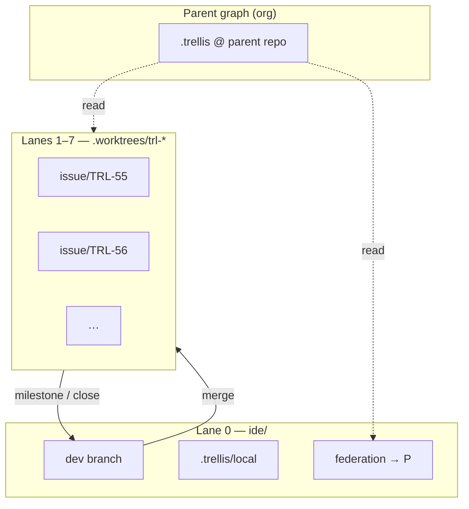

## session branches

**Tracking:** [[TRL-108]] (epic) · children [[TRL-109]]–[[TRL-115]] · spec in this file.

Agent sessions are currently durable execution records, while Trellis branches are explicit project-level version branches. This proposal explores making work-oriented sessions own Trellis branches so concurrent agents can work safely and independently.

### core idea

Do not treat every chat session as a branch. Treat each work session as a branch-backed work lane once it starts changing project state.

```text
Main Session
  owns canonical main branch
  cannot be closed
  receives accepted work from child sessions

Work Session
  may link to an Issue or WorkUnit
  owns an isolated Trellis branch when it mutates files
  can be reviewed, merged, forked, or archived
```

### goals

- Allow concurrent agent work without agents trampling each other.
- Preserve provenance between a session, its tool decisions, and its file changes.
- Make agent tabs feel lightweight while giving them durable Trellis state underneath.
- Support a reviewable finish flow instead of silently applying or discarding work.
- Keep read-only and planning sessions lightweight.

### proposed semantics

#### main session

Each project should have one main session.

- Cannot be closed.
- Owns the canonical accepted project state.
- Acts as the default merge target for work sessions.
- Shows merged session summaries and project-level activity.

#### work session branch lifecycle

A work session should create or claim a branch when it first intends to mutate project state.

Possible branch names:

```text
session/<session-id>
work/<slug>
issue/<issue-id>-<slug>
```

The session should record:

```text
branchName
branchStatus: active | awaiting_review | merged | archived
baseBranch
baseRevision
mergeTarget
linkedIssueID?
linkedWorkUnitID?
```

#### session finish flow

When an agent finishes a branch-backed session, the UI should prompt inline:

```text
Agent finished.

[Continue]
[Review changes]
[Merge into Main]
[Archive without merge]
```

The word "close" should be avoided as the primary action because it is ambiguous. Prefer explicit merge/archive language.

#### archive, not delete

Closing a work session should archive the branch/session rather than hard delete it.

Archiving should preserve:

- Transcript
- Branch metadata
- Tool decisions
- Diffs
- Acceptance results
- Merge outcome
- Final summary

#### forking

Forking a session should fork both conversation context and branch state.

```text
session A -> branch work/A
fork session B from message N -> branch work/B forked from A's corresponding snapshot
```

The UI should eventually support fork-from-current, fork-from-message, compare-to-parent, and merge-to-main or merge-to-parent.

### relationship to work units

Agent sessions should not be identical to WorkUnits.

Recommended relationship:

```text
WorkUnit has many Sessions
Session may target one WorkUnit
Session may own one Branch
Branch may merge into Main
```

A WorkUnit expresses intent and acceptance criteria. A session is an execution attempt or work lane against that intent.

### merge model

Merging needs to handle three conflict classes.

#### text conflicts

Normal file-level conflicts. These can use a three-way diff/merge UI.

#### semantic conflicts

Branches merge cleanly, but the project may be broken because assumptions changed. Trellis should rerun acceptance criteria and summarize affected WorkUnits, Issues, entities, and files.

#### intent conflicts

Two sessions implement competing product directions. These require a human decision and should not be resolved automatically.

### merge UX

A completed session should show:

- Generated summary
- Linked Issue or WorkUnit
- Changed files
- Acceptance criteria status
- Conflicts and warnings
- Base branch/revision
- Current main revision

Possible actions:

- Fast merge when no conflicts and checks pass.
- Review merge to inspect changed files first.
- Resolve conflicts for text conflicts.
- Update from main when the branch is stale.
- Archive without merge.

### incremental implementation plan

#### phase 1: metadata only

Add session branch metadata without changing execution behavior.

#### phase 2: branch on write

Create a Trellis branch when a non-main work session first writes files.

#### phase 3: inline finish prompt

When an agent becomes idle after making changes, prompt to continue, review, merge, or archive.

#### phase 4: happy-path merge

Support no-conflict merge into main, mark the session merged, and archive the branch.

#### phase 5: conflict UX

Add stale branch detection, merge conflict handling, acceptance reruns, and semantic conflict summaries.

### concurrent agent lanes (interim)

Until session-branch automation ships, run multiple agents with **Git worktrees** (filesystem isolation) plus **Trellis issue branches** (intent isolation). OpenCode already supports git worktrees and sandbox registration (`packages/opencode/src/worktree`); Trellis has no `trellis worktree` command yet.

#### three layers

```text
┌─────────────────────────────────────────────────────────────────┐
│  Federation (optional) — parent Trellis graph, read-mostly      │
│  org roadmap · cross-repo issues · shared decisions             │
└────────────────────────────┬────────────────────────────────────┘
                             │ query overlay (not shared writable ops)
┌────────────────────────────▼────────────────────────────────────┐
│  Trellis — branches, issues, ops per lane                       │
│  dev (main) · issue/TRL-* · session/* · work/*                │
└────────────────────────────┬────────────────────────────────────┘
                             │ one branch checked out per directory
┌────────────────────────────▼────────────────────────────────────┐
│  Git — shared object store, multiple working trees              │
│  canonical clone + `.worktrees/trl-*` lanes                     │
└─────────────────────────────────────────────────────────────────┘
```

#### directory layout (example: 7 agents)

`.trellis/config.json` already ignores `.worktrees`. Prefer worktrees **sibling to the repo** (not inside the canonical tree) so the main checkout stays clean.

```text
Packages/turtlecode/
├── ide/                          # Lane 0 — coordinator / main session (branch: dev)
│   └── .trellis/                 # canonical Trellis store (today: shared; see federation)
└── .worktrees/                   # git worktrees (sibling to ide/)
    ├── trl-55-cms-grid/
    ├── trl-56-tts/
    └── …                         # one directory per active issue lane
```

**TRELLIS desk** (`~/TURTLE/Projects/TRELLIS/studio` → same realpath as `ide/`) is fine for opening the coordinator lane; create `.worktrees/` next to the **real** clone path (`Packages/turtlecode/.worktrees/`) so all symlink entry points resolve consistently.

#### bootstrap (per lane)

```bash
# From canonical clone (dev branch)
cd ~/TURTLE/Projects/Packages/turtlecode/ide
mkdir -p ../.worktrees

ISSUE=TRL-55
SLUG=cms-grid
BRANCH="issue/${ISSUE}"
DIR="../.worktrees/${ISSUE}-${SLUG}"

git worktree add -b "$BRANCH" "$DIR" dev
cd "$DIR"
trellis issue start "$ISSUE"
```

#### lane assignment

| Lane | Path | Git branch | Trellis | Role |
|------|------|------------|---------|------|
| 0 | `ide/` (or `TRELLIS/studio/`) | `dev` | default / main session | merge target, review, single dev server |
| 1–N | `../.worktrees/trl-*` | `issue/TRL-*` | `trellis issue start TRL-*` | one issue, scoped files only |

#### coordination rules (manual)

1. **One issue per lane** — never two agents on the same `issue/TRL-*` branch.
2. **Lane 0 merges** — only coordinator integrates to `dev` after `trellis issue check` + `trellis issue close --confirm`.
3. **Ports** — one `bun dev` (4848) and one API (4096) on lane 0; other lanes run tests or use offset ports if UI is required.
4. **No pause/resume inside a lane** — stay on the issue branch for the life of that agent.
5. **Staleness** — before merge, each lane updates from `dev` (`git merge dev` or rebase per team habit).
6. **Lane manifest** — track agent ↔ path ↔ issue until phase 1 session metadata exists (table in `.agent/plans/` or issue descriptions).

Prefer creating lanes through OpenCode’s worktree API when possible so paths register as project **sandboxes**; raw `git worktree add` works if the directory is registered.

#### mapping to implementation phases

| Phase | Manual today | Automation |
|-------|----------------|------------|
| 1 metadata | Lane manifest spreadsheet | Session records `branchName`, `linkedIssueID`, `baseRevision` |
| 2 branch on write | `git worktree add` + `trellis issue start` | First write spawns `issue/<id>` or `session/<id>` |
| 3 finish prompt | Human decides when to merge | UI: Continue / Review / Merge / Archive |
| 4 merge | `git merge` + `trellis issue close` | Trellis merge into `dev` + archive session |
| 5 conflicts | Hand-resolve | Stale detection + semantic AC rerun |

#### ecosystem desk context

The TRELLIS desk (`kernel/`, `studio/`, `cloud/`, `docs/` symlinks) is orchestration plus optional desk-level `.trellis`. Use it for **agent orientation** (ONTOLOGY, `graph/ecosystem.json`, release order) and **`just trellis -r <alias>`** to target spoke graphs with canonical `-p`.

**Code and Trellis ops** for this product run against `studio/` (this repo). Engine store is keyed by `realpath`, so desk paths (`TRELLIS/studio`) and `Packages/turtlecode/ide` share one `.trellis/`.

```bash
# From desk root — symlink-safe
just trellis -r studio issue list
just trellis -r studio status
```

### federated parent graphs (optional)

#### goals

- **Local graph (writable):** file ops, branch state, lane-specific decisions, embeddings for this checkout.
- **Parent graph (read-mostly):** org roadmap, cross-package issues, shared ontology, decisions spanning repos.
- **Optional symlink** for discovery; engine must never treat parent as writable from child lanes.

#### do not symlink the whole `.trellis`

Active stores include `ops.json`, `kernel.db`, and `embeddings.db`. Multiple agents writing through one symlinked `.trellis` risks SQLite corruption, op races, and `issue-counter` collisions. **Never share one writable `.trellis` across concurrent worktrees.**

#### model A — config pointer (recommended)

```jsonc
// .trellis/config.json (child repo)
{
  "federation": {
    "parents": [
      {
        "id": "org",
        "path": "/path/to/parent-repo",
        "mode": "read",
        "include": ["issue", "roadmap", "cycle", "milestone", "decision", "ontology"]
      }
    ]
  }
}
```

- **Writes** → local `.trellis` only.
- **Reads / EQL / issue list** → merge local + parents (define conflict rule: local wins, or prefix parent IDs as `org:TRL-12`).
- **Wiki-links** → `[[TRL-5]]` resolves local first, then parent.

#### model B — symlink as discovery hint

```text
ide/.trellis/
  local/              # real store (ops, kernel, embeddings) — per worktree when split
  parent -> ../../parent-repo/.trellis   # read-only; engine must not write here
```

CLI treats `parent` like `federation.parents[0].path`. Optional: `trellis federation status`.

#### model C — `trellis sync` (exists today)

```bash
trellis sync pull --remote /path/to/parent/.trellis
```

Batch / offline federation; pair with A or B for live read overlay.

**Practical combo:** B + A for ergonomics; C for promotion and CI.

#### namespace

```text
Local:   TRL-55, WU-2, DEC-7
Parent:  org:TRL-12, org:MS-3   # prefixed IDs avoid counter collisions

Cross-graph links (stored locally):
  TRL-55  blockedBy → org:TRL-9
  TRL-55  epic      → org:WU-100
```

Parent entities stay in the parent store; child holds **edges**, not copies.

#### worktrees + federation

```text
ide/                          .trellis/local + federation → parent
.worktrees/trl-55/            own .trellis/local (branch ops)
                              same federation config / parent symlink (read-only)
```

Each lane gets its own **writable local** store when split; all lanes share the same **parent view**.

#### federation implementation phases

| Phase | Deliverable |
|-------|-------------|
| F0 | Document convention: optional `parent` symlink, read-only |
| F1 | `config.federation.parents[]` + read-only guard |
| F2 | Query merge in graph / issue list / semantic search |
| F3 | Cross-graph links (`blockedBy`, `epic`, `duplicates`) |
| F4 | `trellis sync` / `trellis issue promote` for child → parent |

#### parent host candidates

| Host | Role |
|------|------|
| `TRELLIS/` desk (future `.trellis/`) | Ecosystem-wide issues, release pins, cross-repo roadmap |
| `kernel/` (trellis package) | Engine/protocol issues |
| `ide/` | Product issues (current default) |

Decide one **canonical parent** per child repo; avoid chaining symlinks without explicit merge order.

### end-state (7 agents + optional parent)



### open questions

- Should users explicitly choose "work session" vs "chat session"?
- Should branch creation happen at session creation or first write?
- Should selecting a session tab switch Trellis branches automatically?
- How should branch-backed sessions interact with the existing file tree and editor tabs?
- Should subagents create child sessions/branches under a parent session?
- How should multiple child sessions share context without polluting each other's working state?
- Where should the **parent graph** live — `TRELLIS/` desk, `kernel/`, or monorepo root?
- **ID collisions** — prefix (`org:`) vs separate issue counters per graph?
- **Embeddings** — federated search = multi-store query + merge rank?
- **Promotion** — `trellis sync push` vs explicit `trellis issue promote` when closing child issues?
