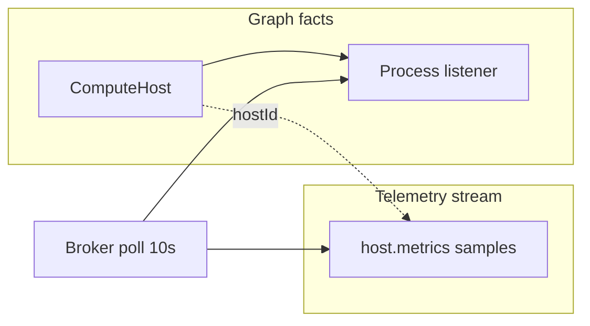

# Workspace Process Discovery

> **Epic:** **TRL-5** (parent) · children **TRL-6**–**TRL-9**  
> Spec captures graph vs telemetry separation, Phase 1 scope, and lifecycle rules agreed in design review (May 2026).

## Summary

Give the agent durable awareness of **what is listening on which ports** in the workspace sandbox, without polluting the graph with time-series stats or short-lived shell noise.

**One-liner:** Broker polls TCP listeners → graph holds `ComputeHost` + `Process` facts with lifecycle → agent calls `list_workspace_processes` before starting dev servers.

**Out of scope for this epic:** Terminal ↔ process linking, per-process CPU/RAM on graph nodes, bundling with terminal split UX (shipped separately).

---

## Two planes (do not conflate)

| Plane | Holds | Does not hold |
|-------|--------|----------------|
| **Graph (facts)** | Stable identity, relationships, slow state (`running` / `stopped`) | `cpu%`, `mem%`, `disk` — stale the moment written |
| **Telemetry (streams)** | Time-series samples keyed by `hostId` | Durable “current stats” as entity props |

`ComputeHost` is a **join node**: sandbox id, region, limits, ownership, workspace/project edges. Processes, terminals, agent runs, and files may point at it later. It is **not** a stats container.

Host metrics (when added) emit as e.g. `host.metrics` events on the existing Trellis telemetry path (`trellis-cloud` events, studio track pattern) — **alongside** the graph, keyed by `hostId`.

---

## Problem

The agent often tries to start a dev server on a port that is already bound (e.g. `:3000`) because it has no structured view of **long-lived listeners** in the sandbox. Terminals and PTY state are workspace-local and are **not** mirrored into the session graph today.

---

## Phase 1 scope (narrow)

### Broker (~every 10s)

- Run `lsof -iTCP -sTCP:LISTEN` (or E2B/sandbox equivalent).
- Diff against previous snapshot.
- **Only** ingest port-bound, long-lived listeners: dev servers, watchers, tunnels, MCP servers.
- **Do not** graph ephemeral shell commands or full `ps` output.

### Graph entities

**`ComputeHost`**

| Field | Notes |
|-------|--------|
| `sandboxId` | Stable sandbox identity |
| `region` | Optional |
| `limits` | Capacity envelope (json) |
| `workspaceId` / project link | Join to workspace |

**`Process`** (listener fact)

| Field | Notes |
|-------|--------|
| `pid` | Best-effort |
| `port` | Primary key for agent queries |
| `command` | Best-effort from lsof |
| `protocol` | `tcp` / etc. |
| `state` | `running` \| `stopped` |
| `firstSeen` / `lastSeen` | ISO or epoch |
| `runsOn` | Edge → `ComputeHost` |

**Explicitly not in Phase 1:** `Terminal → Process` edges.

### Lifecycle (required)

| Event | Action |
|--------|--------|
| Seen in poll | `state: running`, update `lastSeen` |
| Missing **N** consecutive polls (default **3** ≈ 30s at 10s interval) | `state: stopped` |
| Stopped > **M** hours (default **24**) | Archive / exclude from active agent queries |
| Sandbox restart / reprovision | Bulk flip all host processes → `stopped` |

Without lifecycle, ghost listeners accumulate and the graph becomes unreliable.

### Agent surface

- **Tool:** `list_workspace_processes` — active listeners for the current workspace host (port, pid, command, state).
- **Prompt/context (optional):** Inject summary when user mentions ports, dev, deploy, or “already running”.

### Telemetry (Phase 2 — separate issue)

- Stream `host.metrics` samples `{ hostId, ts, cpu, mem, disk, … }` via Trellis events.
- UI/agent read **latest sample** from stream; graph queries remain structural.

---

## Deferred

| Item | When |
|------|------|
| Terminal ↔ process linking | Feature needs it (e.g. “kill server from this tab”) — TIOCGPGRP / cwd heuristics |
| Nested split / terminal UI | Done separately; orthogonal |
| Full process tree | Never as default graph noise |

---

## Implementation map

| Issue | Title | Deliverable |
|-------|--------|-------------|
| **TRL-5** | Epic: Workspace process discovery | Spec + coordination; AC = children done |
| **TRL-6** | Broker: TCP listener poll + lifecycle | Sandbox poll, diff, stop/archive rules, restart bulk-stop |
| **TRL-7** | Graph: ComputeHost + Process sync | Entity types, upsert from broker, TQL/query |
| **TRL-8** | Agent: `list_workspace_processes` | OpenCode tool + workspace host resolution |
| **TRL-9** | Telemetry: host.metrics stream | Event schema + broker emit (no graph props) |

Suggested order: **TRL-6 → TRL-7 → TRL-8 → TRL-9**.

---

## Acceptance (epic)

- [ ] With a dev server listening on `:3000`, agent tool returns that listener without user pasting `lsof`.
- [ ] After listener exits, process entity is `stopped` within N poll misses.
- [ ] After sandbox restart, no `running` processes remain for old host identity.
- [ ] Graph `ComputeHost` has no `cpu`/`mem` props; optional telemetry event documented in TRL-9.
- [ ] No terminal↔process edges in Phase 1 schema.

---

## Implementation status (OpenCode / Studio)

| Issue | Status | Location |
|-------|--------|----------|
| TRL-6 | Partial | [`trellis-cloud/src/workspace-listeners.ts`](../../trellis-cloud/src/workspace-listeners.ts) — E2B `lsof` poll; wire 10s broker loop + graph push TBD |
| TRL-7 | Done (local) | [`packages/opencode/src/workspace-process/sync.ts`](../packages/opencode/src/workspace-process/sync.ts) — `ComputeHost` + `Process` in Trellis store |
| TRL-8 | Done | [`packages/opencode/src/tool/list-workspace-processes.ts`](../packages/opencode/src/tool/list-workspace-processes.ts) |
| TRL-9 | Scaffold | [`packages/opencode/src/workspace-process/telemetry.ts`](../packages/opencode/src/workspace-process/telemetry.ts) — event schema only |

Studio/agent sessions poll `lsof` on `Instance.directory` every 10s when the tool or monitor starts (works in local and in-sandbox Studio).

---

## References

- [design-brand-kit.md](./design-brand-kit.md) — sandbox / graph federation context
- [agent-testable-runtime.md](./agent-testable-runtime.md) — agent affordances pattern
- `filegraph/src/features/agent/context/processRegistry.ts` — prior art (local Zustand, not IDE graph)
- `trellis-cloud/src/track.ts` — behavioral telemetry emit pattern
